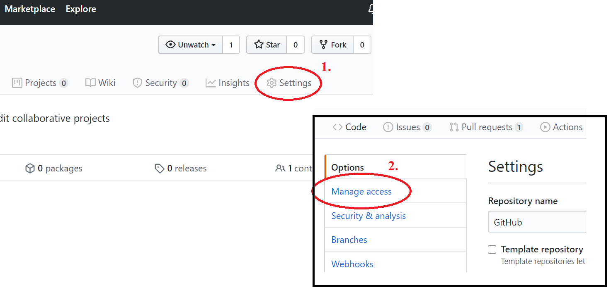
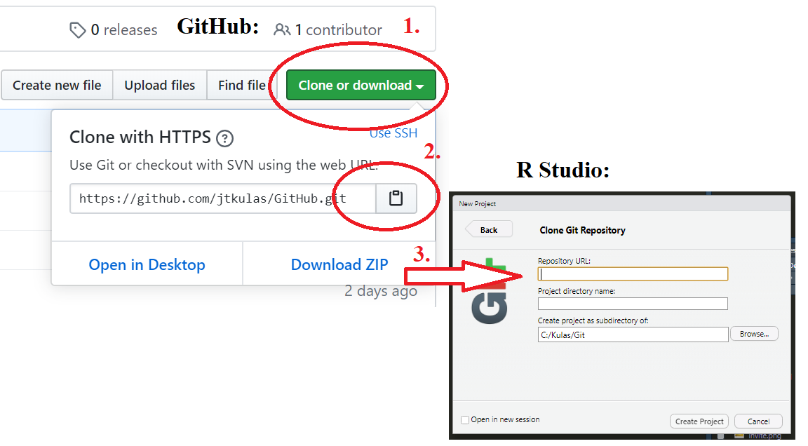
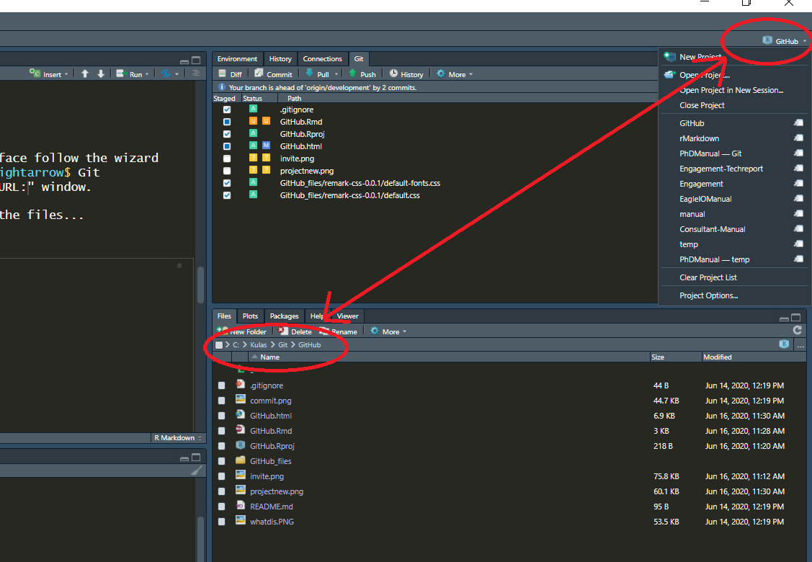
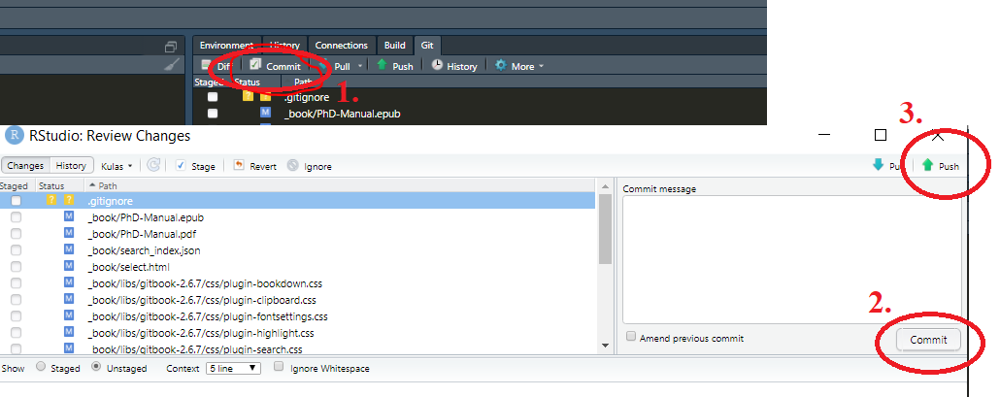
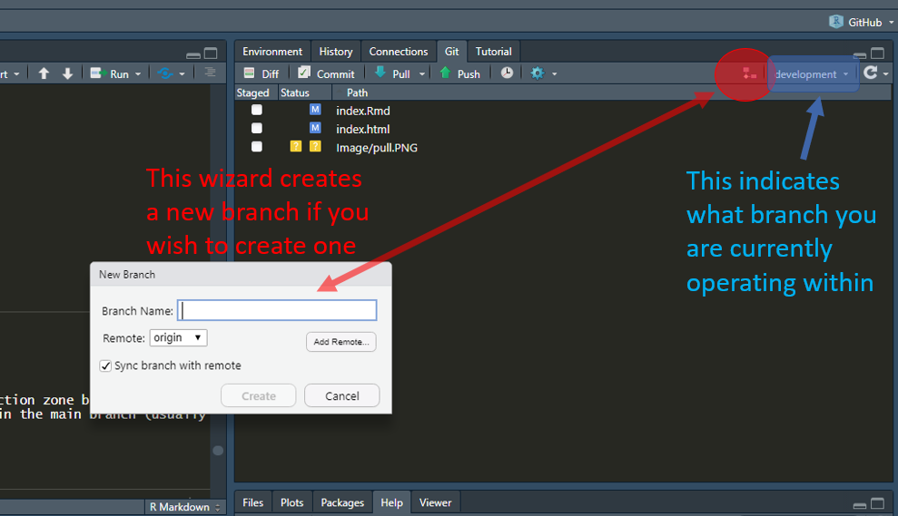
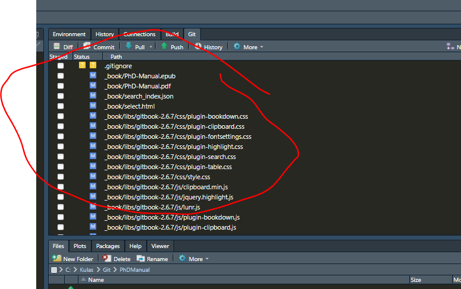

```{r setup, include=FALSE}
knitr::opts_chunk$set(echo = FALSE)
```


## Learning to use GitHub through R Studio

Summer 2020 Eagle I.O Team: 
+ Renata Garcia Prieto Palacios Roji [`r  icon::fa_linkedin(colour = "pink")`](https://www.linkedin.com/in/renatagppr/)
+ Casey Osorio-Duffoo [`r  icon::fa_linkedin(colour = "blue")`](https://www.linkedin.com/in/casey-osorio-duffoo/)
+ Noel D'Souza [`r  icon::fa_linkedin(colour = "red")`](https://www.linkedin.com/in/noel-d-souza-60101a125/)

---

## Goals

1. figure out how to integrate GitHub and R Studio
2. connect individual accounts to shared projects
3. figure out branches and forks (and how to use them)
4. learn how to ask for a task to be completed
5. learn how to approve tasks
6. share what we've learned with the larger group (if interested)


---

## How to integrate RStudio and GitHub

This [site](https://happygitwithr.com/install-git.html) walks-through the setup from within RStudio.


---

## Connecting individual accounts to shared projects (Step I)

Invite collaborators from within the GitHub repo:



...you'll need their GitHub username

---

## Connecting individual accounts to shared projects [(Step II)](https://www.youtube.com/watch?v=YxZ8J2rqhEM)

First access the GitHub repository url, then, within the R Studio interface follow the wizard via: File $\rightarrow$ *New Project* $\rightarrow$ Version Control $\rightarrow$ Git $\rightarrow$ paste the GitHub repository address into the "Repository URL:" window.

Note that you'll also indicate a local (on your computer) location for the files...




---

## Connecting individual accounts to shared projects (Success) 

You now have a "project" that you can access from within R Studio, but is linked to the GitHub files (as well as somewhere locally on your computer)



---

## Then what?

You can now work on shared .Rmd files via local editing. A "commit" saves your edits, whereas a "push" sends your saved changes (aka "commits") to the online GitHub repository.

There's a decent YouTube overview [here](https://www.youtube.com/watch?v=KjLycV1IWqc)



---

## [Forking vs. branching](https://www.pluralsight.com/blog/software-development/the-definitive-guide-to-forks-and-branches-in-git#:~:text=Forking%20creates%20a%20full%20copy,what%20branch%20you%20are%20using.-)

Sounds like forks are different paths that a project may take (e.g., point of divergence) toward a different end-goal, whereas branches are shorter-term (typically) "construction zones" where edits can be temporarily held before being integrated into the master branch.


---

## Defining a new branch

Best practice seems to entail creating a branch within which proposed edits can be made and reviewed prior to "pulling" these changes to the master branch (the master is where the initial files were placed, but also where the final product will be located).

You can create a new GitHub branch from within RStudio via the `New Branch` option on the `Git` tab of RStudio's "Environment/History" panel:



---

## Lingering questions...

What are all of these files? (they keep multiplying)



Heya

---

## Tasks for next meeting

+ figure out push and pull
+ how to request a change
+ how to stage

