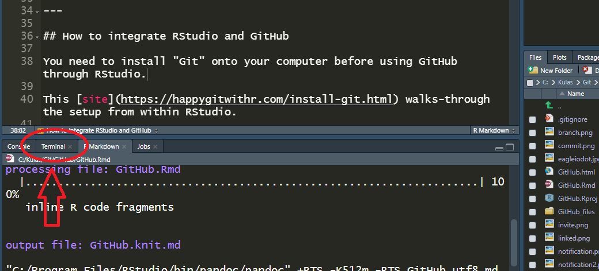
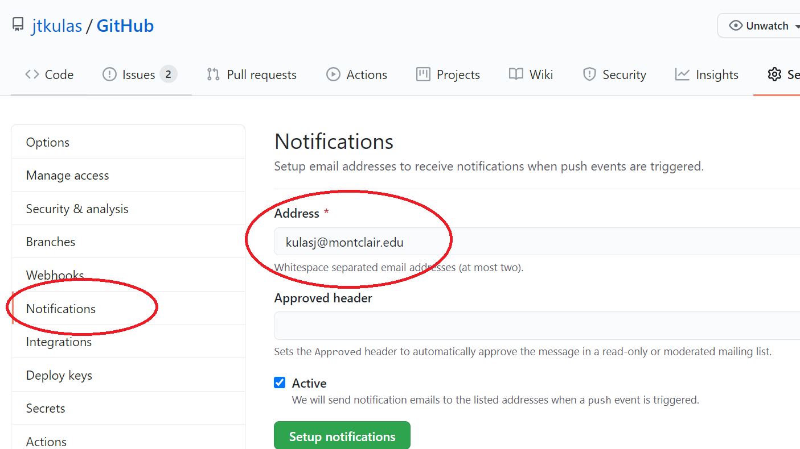
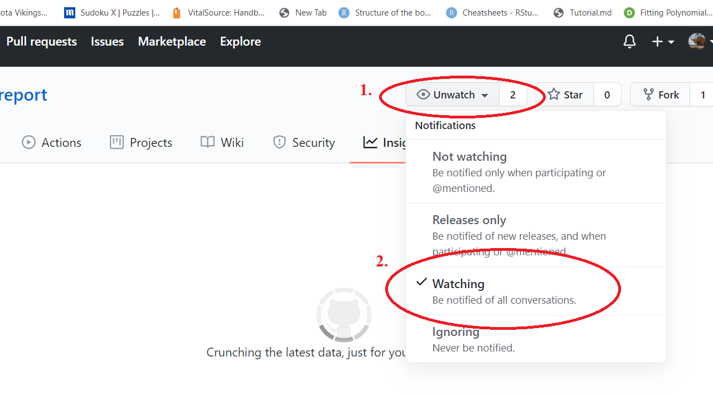

```{r setup, include=FALSE}
knitr::opts_chunk$set(echo = FALSE)
```


## Using GitHub through R Studio

Summer 2020 Eagle I.O Team: 
+ [`r  icon::fa_linkedin(colour = "cornflowerblue")`](https://www.linkedin.com/in/renatagppr/) Renata Garcia Prieto Palacios Roji 
+ [`r  icon::fa_linkedin(colour = "cornflowerblue")`](https://www.linkedin.com/in/casey-osorio-duffoo/) Casey Osorio-Duffoo 
+ [`r  icon::fa_linkedin(colour = "cornflowerblue")`](https://www.linkedin.com/in/noel-d-souza-60101a125/) Noel D'Souza 

---

## Topics covered

1. How to integrate GitHub and R Studio
2. Connecting individual accounts to shared projects
3. Branches and forks (and how to use them) 
4. How to ask for a task to be completed
5. How to approve tasks


---

## How to integrate RStudio and GitHub

You need to install "Git" onto your computer before using GitHub through RStudio.

This [site](https://happygitwithr.com/install-git.html) and the following slide walk you through the setup. 


---

## What's a "Shell"?

You're going to be asked to operate from within a "shell". A shell is an access point to your computer that operates somewhere behind your operating system (for example, Windows). You can access shells outside of RStudio, but if you'd like to access a shell from *within* RStudio, you can do so - the "Terminal" tab within RStudio is actually a "shell":



...there is also a YouTube walk-through located  [here](https://youtu.be/lXwH2R4n3RQ)


---

## Connecting individual accounts to shared projects (Step I)

Invite collaborators from within the GitHub repo:


...you'll need their GitHub username

---

## Connecting individual accounts to shared projects [(Step II)](https://www.youtube.com/watch?v=YxZ8J2rqhEM)

First access the GitHub repository url, then, within the R Studio interface follow the wizard via: File $\rightarrow$ *New Project* $\rightarrow$ Version Control $\rightarrow$ Git $\rightarrow$ paste the GitHub repository address into the "Repository URL:" window.

Note that you'll also indicate a local (on your computer) location for the files...


---

## Connecting individual accounts to shared projects (Success) 

You now have a "project" that you can access from within R Studio, but is linked to the GitHub files (as well as somewhere locally on your computer)


---

## Then what?

You can now work on shared .Rmd files via local editing. A "commit" saves your edits, whereas a "push" sends your saved changes (aka "commits") to the online GitHub repository.

There's a decent YouTube overview [here](https://www.youtube.com/watch?v=KjLycV1IWqc)


---

## Using the repository

Especially with shared projects, every time you access the project, make sure to "pull" - this will ensure that you have (locally) the most up-to-date information that is located on the shared repository:


---

## [Forking vs. branching](https://www.pluralsight.com/blog/software-development/the-definitive-guide-to-forks-and-branches-in-git#:~:text=Forking%20creates%20a%20full%20copy,what%20branch%20you%20are%20using.-)

Sounds like forks are different paths that a project may take (e.g., point of divergence) toward a different end-goal, whereas branches are shorter-term (typically) "construction zones" where edits can be temporarily held before being integrated into the master branch.


---

## Defining a new branch

Best practice seems to entail creating a branch within which proposed edits can be made and reviewed prior to "pulling" these changes to the master branch (the master is where the initial files were placed, but also where the final product will be located).

You can create a new GitHub branch from within RStudio via the `New Branch` option on the `Git` tab of RStudio's "Environment/History" panel:


---

## Lingering questions...

What are all of these files? (they keep multiplying)


Heya

---

## Tasks for next meeting

+ figure out push and pull
+ how to request a change
+ how to stage

---

## Notifications

In order to recieve notification that a push has been made to a repository that you own, navigate to the repository, then indicate up to 2 e-mails that you would like to "sign-up" for... 


---

## Notifications (II)

If you wish to recieve notifications from a repository that you collaborate on (but do not "own"), you can select to watch that repository:

