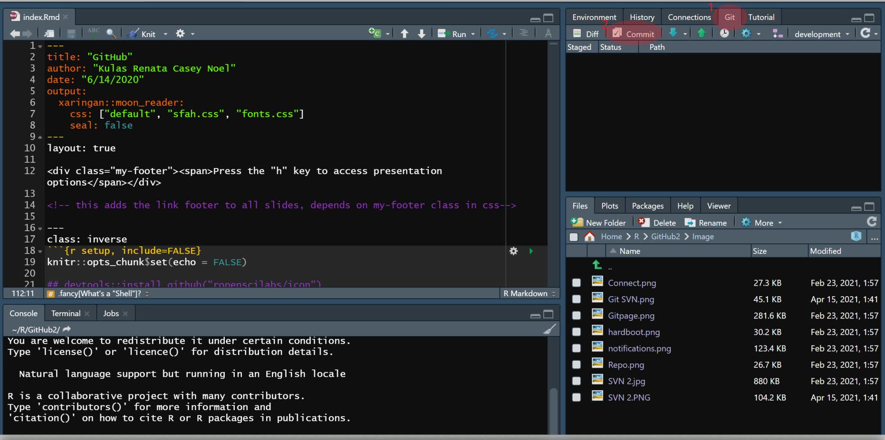
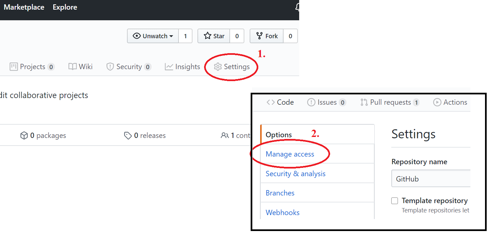
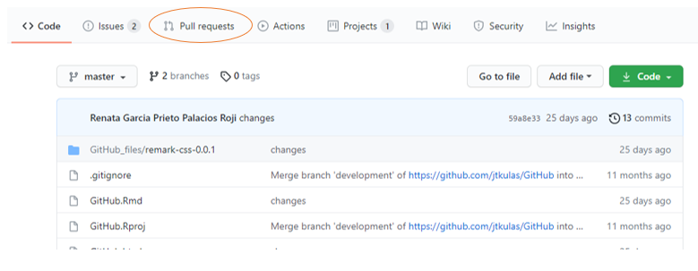

layout: true
  
<div class="my-footer"><span>Press your keyboard's "h" key to access presentation options</span></div>

<!-- this adds the link footer to all slides, depends on my-footer class in css-->

---

```{r setup, include=FALSE}

library(icons)
knitr::opts_chunk$set(echo = FALSE, fig.retina=3)

## devtools::install_github("ropenscilabs/icon")
## devtools::install_github("hadley/emo")

```


.left-column[# Using GitHub `r fontawesome("github")` through `r icon_style(fontawesome("r-project"), fill="royalblue")` Studio 
]

<div class="right">
.right-column[


### Summer 2020 Eagle I.O tutorial

]
</div>

---
class: inverse

### [Eagle I.O](https://www.eagle-io.com/) Contributors:
<font size="5"> 
.pull-left[
[`r  icon_style(fontawesome("linkedin"), fill="cornflowerblue")`](https://www.linkedin.com/in/renatagppr/) .fancy[Renata García Prieto Palacios Roji]  

[`r  icon_style(fontawesome("linkedin"), fill="cornflowerblue")`](https://www.linkedin.com/in/noel-d-souza-60101a125/) .fancy[Noel D'Souza]  

]

.pull-right[
[`r  icon_style(fontawesome("linkedin"), fill="cornflowerblue")`](https://www.linkedin.com/in/casey-osorio-duffoo/) .fancy[Casey Osorio-Duffoo]  

[`r  icon_style(fontawesome("linkedin"), fill="cornflowerblue")`](https://www.linkedin.com/in/john-kulas-184a031/) .fancy[John Kulas]  

]
</font>

---

## Topics covered

1. How (and why) to integrate GitHub `r fontawesome("github")` and `r icon_style(fontawesome("r-project"), fill="royalblue")` Studio 
2. Connecting individual accounts to shared projects
3. Committing, pushing, and pulling 
4. How to ask for a task to be completed
5. How to approve tasks

{height=500, width=500}
???
Our optimization of this workflow is evolving over time. The most recent rendering of this document was `r format(Sys.time(),format="%B %d, %Y")`

---

## Why you want to do this - 1: `r emo::ji("cool")`

.pull-left[
Using a version control platform (such as [GitHub](https://www.github.com)) facilitates collaboration on projects from multiple people and limits the number of *different versions* that exist of the collaborative material.]

.pull-right[
`r icon_style(fontawesome("r-project"), fill="royalblue")` Studio integrates really easily with GitHub, so it turns out to be a very useful way to share scripts and efficiently work on projects [such as this current tutorial!](https://github.com/jtkulas/GitHub/tree/development)]


---
## Why you want to do this - 2: `r emo::ji("floppy_disk")`

If you follow the "push" and "pull" recommendations in this tutorial, you will reduce the number of different versions of a project that exist among collaborators and have a shared location where everyone has access to the most recent version of your project.


???
Blissfully bid a fond adieu to your collaborators' iterative forwardings of *mypaper(4)_1.32.20_newest.doc* `r emo::ji("waving_hand")` .
---

## How to integrate `r icon_style(fontawesome("r-project"), fill="royalblue")` Studio and GitHub `r fontawesome("github")`

Before accessing GitHub through `r icon_style(fontawesome("r-project"), fill="royalblue")` Studio, you'll first need to install some "Git" software onto your computer .

This [site](https://happygitwithr.com/install-git.html) (in addition to the next few slides) walks you through the setup. An entire book dedicated to Git and `r icon_style(fontawesome("r-project"), fill="royalblue")` Studio integration is [located here](https://happygitwithr.com/)


---

## Additional tutorials

.pull-left[
## .fancy[As you navigate this presentation, if you find yourself stuck, there are also `r icon_style(fontawesome("youtube"), fill="red")` tutorials located [here](https://youtu.be/lXwH2R4n3RQ) and  [here](https://www.youtube.com/watch?v=Pg8LeOfvQME)  
]]

.pull-right[

]

---
class: inverse

## .fancy[Installing Git (Part I)] 

Git is a platform tool that is used by software developers for source code management.  You need it in order to use GitHub. To install Git on you computer, [go to the website](https://git-scm.com/downloads). This is what the website should look like:  


???
[GitHub](https://github.com/) is a company that offers cloud-based hosting and also makes git a little easier to use for non-coders. [This video](https://youtu.be/21Gl97tkbHU) presents some background on Git and GitHub. GitHub is a great way to use Git through `r icon_style(fontawesome("r-project"), fill="royalblue")` studio.

---
class: inverse

## .fancy[Installing Git (Part II)] 

<font size = "5">Follow the download instructions and <span style="color:royalblue">take note of where Git is located on your computer</span> (e.g., what is the folder location?). </font>  

.pull-left[

]

.pull-right[
+ <font size = "6">You will most likely need this information when connecting to GitHub from within `r icon_style(fontawesome("r-project"), fill="royalblue")` studio.</font> 
]

???
If you didn't notice the folder location, use the **File Explorer** and do a search for `*.exe`... this will pull up a few files, but one of them should be the git executable.

---
class: inverse

## .fancy[What's a "Shell"] `r emo::ji("turtle")`?

At some point you may be asked to operate from within a "shell" (you don't need to do so, but the suggested download site does ask you to use a shell). A shell is an access point to your computer that operates somewhere behind your operating system (for example, Windows). You can access shells outside of `r icon_style(fontawesome("r-project"), fill="royalblue")` Studio, but if you'd like to access a shell from *within* `r icon_style(fontawesome("r-project"), fill="royalblue")` Studio, you can also do so - the "Terminal" tab within `r icon_style(fontawesome("r-project"), fill="royalblue")` Studio is actually a "shell":


---

## <span style="color:blue">**After**</span> you've successfully installed "Git" onto your computer: 

.pull-left[
### Step 1: Tell `r icon_style(fontawesome("r-project"), fill="royalblue")` Studio  where your download of Git is located

From within `r icon_style(fontawesome("r-project"), fill="royalblue")` Studio: 
- Go to `Tools`  (it is between `Profile` and `Help`) 
- Then, click on `Global Options`
- Next, click on `Git/SVN` 
]

.pull-right[

]

---

## Step 2: Connect Git `r fontawesome("github")` & `r icon_style(fontawesome("r-project"), fill="royalblue")` Studio

.pull-left[
Find where you downloaded "Git" and link to the location within the `Git executable:` field

For example, on our windows computer, we navigated to `this PC`
- Click on `Windows (C:)`
- Click on `Program Files Folder`
- Click on `Git Folder`
- Click on `bin folder`
- Click on `git.exe`
]

.pull-right[

]

---

## Good job!!

.center[<font size="6">.fancy[...you are now ready to access GitHub `r fontawesome("github")` files from within `r icon_style(fontawesome("r-project"), fill="royalblue")` Studio]</font>
]

.center[
]
]

---

# .fancy[Now Wut?!?]

Now you need a project to collaborate on. You can use [this current presentation](https://github.com/jtkulas/GitHub/tree/development) as an example project if you wanna be meta!!! (just beware we use some packages that you'll need to install via `devtools` or `remotes` because they're hosted on GitHub `r fontawesome("github")`, not CRAN). If meta scares you, you can try a [simpler project](https://github.com/jtkulas/temp/tree/master).

.center[
]

???
You should be able to connect to any project that's *public* on GitHub, so search around a bit on [www.github.com](https://github.com/). You just won't be able to "push" (discussed on a later slide).

---
class: inverse

## .fancy[[Connecting to a GitHub project (Step I)](https://www.youtube.com/watch?v=YxZ8J2rqhEM)]

First access the GitHub repository that you'd like to connect to (online at [www.github.com](https://github.com/)), then copy the web URL to your clipboard:


---
class: inverse

## .fancy[[Connecting to a GitHub project (Step II)](https://www.youtube.com/watch?v=YxZ8J2rqhEM)]

Once you've copied the GitHub repository url, open `r icon_style(fontawesome("r-project"), fill="royalblue")` Studio. Then, within the `r icon_style(fontawesome("r-project"), fill="royalblue")` Studio interface follow the wizard via: File $\rightarrow$ New Project $\rightarrow$ Version Control: 

.pull-left[

]

.pull-right[

]

---
class: inverse

## .fancy[[Connecting to a GitHub project (Step III)](https://www.youtube.com/watch?v=YxZ8J2rqhEM)]

Continue with $\rightarrow$ Git and then paste the GitHub repository address that you copied from [www.github.com](https://github.com/) into the `Repository URL:` window.

Note that you'll also need to indicate a local (on your computer) location for the files...

.pull-left[

]

.pull-right[

]

---
class: inverse

## .fancy[Connecting to a GitHub project (Success!!!)] 

You now have a "project" that you can access from within `r icon_style(fontawesome("r-project"), fill="royalblue")` Studio, but is linked to the GitHub files (as well as somewhere locally on your computer)


---

## Then what?

You can now work on shared `r icon_style(fontawesome("r-project"), fill="royalblue")` files via local editing. A "commit" saves your local edits, whereas a "push" sends your saved changes (aka "commits") to the online GitHub repository, but only if you have permission to do so.

There's a decent YouTube overview of the workflow process  [here](https://www.youtube.com/watch?v=KjLycV1IWqc)


---

## Pushing and Pulling

After working on a project (on your computer), you'll likely want to upload your changes to your Github repository. You do this by accessing the 1. `Git` tab from within `r icon_style(fontawesome("r-project"), fill="royalblue")` Studio. Select the documents you'd like to upload and hit the 2. `commit` button. 


---

## Pushing to Github

Committing initializes a pop up window where you will annotate your changes (e.g., what and why you did to the files). After 1. `committing`, you also need to 2. `push` to send those changes back up to the GitHub repository. Once you do that, everyone who you are collaborating with can see and access the changes.


???
All of this can also be accomplished via *GitBash* commands that you can type into your terminal. We currently use the *GitBash* command of `git add -A` instead of `r icon_style(fontawesome("r-project"), fill="royalblue")` Studio's wizard. `git add -A` solves lag issues you may encounter when using the `r icon_style(fontawesome("r-project"), fill="royalblue")` Studio commit wizard (the wizard window is shown on this slide).

---

## Tricks of the trade

.pull-left[The previous slides should be sufficient to get you connected to a project that's hosted on GitHub.  

The following slides focus on some workflow recommendations - how we think you should (at least initially) use GitHub through `r icon_style(fontawesome("r-project"), fill="royalblue")` Studio. This includes:  

1. Inviting collaborators
2. Using notifications
2. Structuring (forking and branching)
]

.pull-right[
]

---
class: inverse

## .fancy[Collaborating with others]

You can invite collaborators to contribute to your projects. This is actually how you "grant permission" for others to push to your repository. However, before you do this (from within your GitHub account), <span style="color:royalblue">**they**</span> need a GitHub account and <span style="color:royalblue">**you**</span> need to know their GitHub username...




---
class: inverse 

## .fancy[Using (a now shared) repository]

Especially when working on *shared* projects, make sure to "pull" <span style="color:royalblue">every time you access the project</span> - this will ensure that you have (locally) the most up-to-date information that is available for the shared project.

.pull-left[

]

.pull-right[

]

---
class: inverse 

### .fancy[.salt[However...]]

Take note here that if you try "pulling" prior to committing any local changes you have made, you will encounter a **conflict**

.pull-left[

]

.pull-right[.large[We do have a helpful work-around for when this happens...]]

---

class: inverse 

### .fancy[.salt[Resolving conflict(s)]]

Working from within your `terminal`, the two git commands listed below will: 1) **stash** your local changes (away from your shared repository), and 2) permanantly delete those stashed files

.pull-left[ 
Take note here that any **new** work you've done locally will be obliviated... this work-around is therefore most useful only when the information on the repository is reasonably considered to be *more* important or *more* up-to-date:

1. `git stash --include-untracked`
2. `git stash drop`
]

.pull-right[

]

???
Obviously this work-around is only helpful if you're willing to prioritize the repository information over your local information. If you want to use this method but also salvage both conflicting files, you can copy/paste your local code into a Notepad file, and then incorporate after you've pulled from the repository...


---

## Notifications

There is an option to be notified (via e-mail) when somebody makes a push to a repository that you "own". This alerts you to the fact that a change has been made, and reminds you that you should "pull" prior to working on the project. To activate these notifications, navigate to the repository on GitHub, then enter your e-mail address... 


---

## Notifications (II)


.pull-left[

]

.pull-right[
<font size="5">.fancy[If you wish to recieve notifications from a repository that you collaborate on but do not "own", [GitHub has depreciated that legacy  function](https://github.community/t/get-notified-of-all-commits-to-all-branches-of-a-repo/759). The cleanest workaround that we have found seems to be [to use  zzBots](https://www.youtube.com/watch?v=jssX19RsozQ). Note however that the free version of zzBots limits you to notifications from only two unowned repositories.]
]</font>

---

## Notifications (III) `r emo::ji("robot")`

1. Sign up for a free [zzBots account](https://www.zzbots.com/)
2. Connect your new zzBots account to GitHub
3. Follow the menu to create a new bot 
4. Indicate bot name and follow prompts (starting with "send email")


---

## Notifications (IV) `r emo::ji("confused")`

Just as a FYI, it sounds helpful, but the GitHub option of "watching"  ...is only useful if you want to keep an eye on other peoples' repositories (projects that you aren't an invited contributor to) `r emo::ji("sad")`

.pull-left[

]

.pull-right[

]

---
class: inverse

## .fancy[Forking & branching]

Forks are different paths that a project may take (e.g., points of divergence in purpose) toward a different end-goal, whereas branches are shorter-term (typically) "construction zones" where edits can be temporarily held before being integrated into the master branch. There are a few helpful descriptions located [here](https://youtu.be/KDUtjZHIx44?t=658) [here](https://support.atlassian.com/bitbucket-cloud/docs/branch-or-fork-your-repository/) and [here](https://www.pluralsight.com/blog/software-development/the-definitive-guide-to-forks-and-branches-in-git#:~:text=Forking%20creates%20a%20full%20copy,what%20branch%20you%20are%20using.-)

If you find a repository that you'd like to copy (e.g., use it as a template to build something yourself), then "fork" it.


---
class: inverse

## .fancy[Defining a new branch]

Best *developer* practice seems to entail creating branches within which proposed edits can be made and reviewed prior to "merging" back into the master branch (the master is where the initial files were placed, but also where the final product will be located).

You can create a new GitHub branch from within RStudio via the `New Branch` option on the `Git` tab of `r icon_style(fontawesome("r-project"), fill="royalblue")` Studio's "Environment/History/etc." pane.


---
class: inverse

## .fancy[Defining a new branch (recommendation)]

.left-column[.fancy[Although it makes sense for *developers* to operate on different construction zone branches, us mere Psychologists have found branches to be more cumbersome than useful, so, just work within the main branch (usually called "master").]
]
.right-column[

]

???
If you still want to work with branches, make sure you understand the broader merge process - branches being ahead and behind each other seems to create chaos 

---

## Pull request:

When it comes time to *integrate* different versions on your shared project, you may consider a `pull request`. This makes it possible to:

1. Get feedback (from other collaborators) on your proposed contribution, &
2. Document the discussion regarding the contribution

https://docs.github.com/en/free-pro-team@latest/github/collaborating-with-issues-and-pull-requests/creating-a-pull-request



---

## Pull request (also):

Pull requests are also options for open source projects where you are not formally a collaborator but wish to make a suggestion. This is how some of the alternative coins conduct their operations.

https://docs.github.com/en/free-pro-team@latest/github/collaborating-with-issues-and-pull-requests/creating-a-pull-request


???  
See, for example, the [ethereum](https://github.com/ethereum) network of repositories.

---

## Pull request:

https://docs.github.com/en/free-pro-team@latest/github/collaborating-with-issues-and-pull-requests/creating-a-pull-request


---
## Pull request:

https://docs.github.com/en/free-pro-team@latest/github/collaborating-with-issues-and-pull-requests/creating-a-pull-request


---
## Pull request:

https://docs.github.com/en/free-pro-team@latest/github/collaborating-with-issues-and-pull-requests/creating-a-pull-request


---
## Pull request:

https://docs.github.com/en/free-pro-team@latest/github/collaborating-with-issues-and-pull-requests/creating-a-pull-request


---
## Pull request:

https://docs.github.com/en/free-pro-team@latest/github/collaborating-with-issues-and-pull-requests/creating-a-pull-request


---
## Pull request:

https://docs.github.com/en/free-pro-team@latest/github/collaborating-with-issues-and-pull-requests/creating-a-pull-request


---
## Pull request:


---
## Pull request:


---
## Pull request:


---
## Pull request:


---
## Pull request:


---
## Pull request:


---
## Pull request:


---

## Issues:

[Creating an issue](https://docs.github.com/en/free-pro-team@latest/github/managing-your-work-on-github/creating-an-issue), which is similar to creating a task: 

[How to assign an issue](https://docs.github.com/en/free-pro-team@latest/github/collaborating-with-issues-and-pull-requests/creating-a-pull-request): 


---
class: inverse

###.salt[Let us know if you have any questions]

.pull-left[

]

.pull-right[
.fancy[[Eagle I.O](https://www.eagle-io.com/)]
 
[`r  icon_style(fontawesome("linkedin"), fill="cornflowerblue")`](https://www.linkedin.com/in/renatagppr/) .fancy[Renata García Prieto Palacios Roji]  

[`r  icon_style(fontawesome("linkedin"), fill="cornflowerblue")`](https://www.linkedin.com/in/noel-d-souza-60101a125/) .fancy[Noel D'Souza]  

[`r  icon_style(fontawesome("linkedin"), fill="cornflowerblue")`](https://www.linkedin.com/in/casey-osorio-duffoo/) .fancy[Casey Osorio-Duffoo]  

[`r  icon_style(fontawesome("linkedin"), fill="cornflowerblue")`](https://www.linkedin.com/in/john-kulas-184a031/) .fancy[John Kulas]  
]
